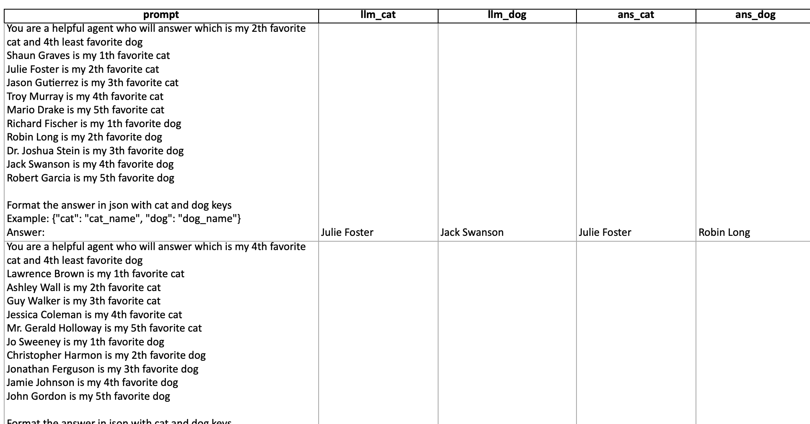

Inspired by Hamel's virtual cycle presented by Hamel in this talk at AI Engineer Convference

https://www.youtube.com/watch?v=eLXF0VojuSs


I am going to follow this approach for a simple workflow
- Previously user mentions their cat's names ranked by favouriteness
- This time they mention dog's names ranked in reverse favouriteness
- This time query is to find the name of their nth favourite cat and mth favourite dog combination
- AI returns the name of the cat and dog

Requirements
1. Ability to see the prompt | llm_response | test_result(non-llm)
2. Test with llm_as a judge with accuracy as the metric


Process
1. I intentionally ran it on a very small mode, `gemini-2.5-flash-lite`, and we get `16%` accuracy with it.
2. Common mistake that the model makes is it ignores the `least` text and even when I ask it go give me 2nd least favourite dog, returns me 2nd favourite dog. In `50%` cases where it is correct it is because the number is `3rd` for which least and most favourite are same.
3. Viewing the results in a viewable format.

4. Trying out dspy for optimization


Exploring dspy api

```python
import random
from typing import Literal

from datasets import load_dataset

import dspy
from dspy.datasets import DataLoader

# Load the Banking77 dataset.
CLASSES = load_dataset("PolyAI/banking77", split="train", trust_remote_code=True).features["label"].names
kwargs = {"fields": ("text", "label"), "input_keys": ("text",), "split": "train", "trust_remote_code": True}

# Load the first 2000 examples from the dataset, and assign a hint to each *training* example.
trainset = [
    dspy.Example(x, hint=CLASSES[x.label], label=CLASSES[x.label]).with_inputs("text", "hint")
    for x in DataLoader().from_huggingface(dataset_name="PolyAI/banking77", **kwargs)[:2000]
]

CLASSES = ["cat", "dog"]
trainset = [
    dspy.Example()
]


print(CLASSES)
print(trainset[0])
```

```markdown
['activate_my_card', 'age_limit', 'apple_pay_or_google_pay', ...] //CLASSES

Example({'text': 'What if I type in the wrong PIN too many times?', 'label': 'pin_blocked', 'hint': 'pin_blocked'}) (input_keys={'hint', 'text'}) //trainset[0]
```

Essentiall this does the job for us

```python
import dspy

CLASSES = ["cat", "dog"]
trainset = [
    dspy.Example(
        text="Which animal meows?",
        label=CLASSES[0]
    ).with_inputs("text", "label"),
    dspy.Example(
        text="Which animal barks?",
        label=CLASSES[1]
    ).with_inputs("text", "label")
]


print(CLASSES)
print(trainset[0])
```

```markdown
['cat', 'dog']
Example({'text': 'Which animal meows?', 'label': 'cat'}) (input_keys={'text', 'label'})
```

